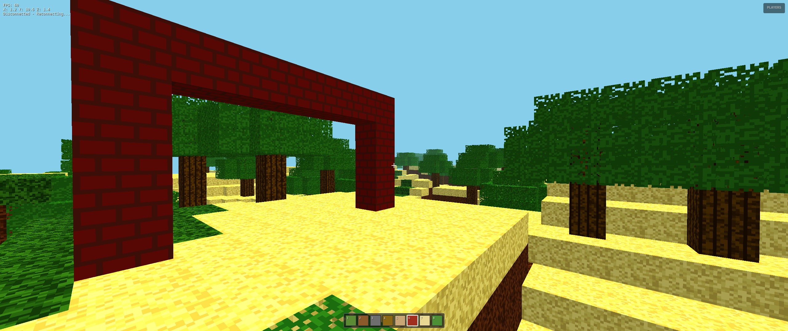

# MineCloud

A browser-based multiplayer Minecraft-like game, with voxel rendering in `Three.js` and a Go server using WebSockets.

## Gameplay



## Features

- Browser-rendered voxel world.
- Real-time multiplayer over WebSockets.
- Procedural terrain.
- Visible biome variety, including plains, forests, rocky zones, and deserts with cactus.
- Extra decorative flora, including tall grass, flowers, and mushrooms.
- Ambient interactive mobs: sheep, ducks, pigs, adorable giraffes, colorful macaws, and friendly dogs.
- First-person movement with auto-step over 1-block ledges.
- Optional third-person camera view.
- Sneak/crouch movement for careful building and edge safety.
- Health system with fall damage, respawn, and a persistent safe-position restore.
- Death screen with respawn countdown.
- Basic food consumption to recover health.
- Swimmable water with underwater visual feedback.
- Hold-to-mine blocks with impact particles, crack overlay, and first-person hand animation.
- Mined blocks above the player can visibly fall before becoming pickups.
- Place blocks from a real hotbar inventory with floating collectible drops.
- Pickup magnet effect for nearby drops.
- Beds that set your respawn point when placed.
- Sleeping in a bed can skip the night.
- Placeable sign blocks with persistent shared text.
- Sign blocks support emoji voting reactions.
- Full sign reading panel for longer sign messages.
- Craftable torches with placed dynamic light.
- Craftable multiplayer sound blocks with nearby positional audio.
- Block inspector overlay that shows information about the block you are aiming at.
- Humanoid remote player avatars with nametags and smoothed movement.
- Facial details on player avatars, with player-specific clothing colors derived from identity.
- Local footsteps, nearby remote footsteps, and light camera bob while walking.
- Nearby remote footsteps with distance-based audio.
- Crafting system with recipes for blocks like `glass` and `stone_bricks`.
- Expandable inventory panel with visual icons and stable hotbar controls.
- Toggleable RTX-style visual mode with upgraded lighting, materials, and real texture assets for key blocks.
- Visible cube sun and moon in the sky, including moon phases.
- Dynamic day/night cycle.
- Dynamic rain with visual and lighting changes.
- Procedural sound effects for mining, placing, jumping, and pickups.
- Multiplayer chat, player mentions by clicking avatars, system join/leave messages, and death messages.
- Player roster supports click-to-follow camera mode.
- Chat slash commands such as `/help`, `/spawn`, `/mob giraffe`, `/mob macaw`, `/mob dog`, `/sayhere`, `/ping`, `/react`, `/laugh`, `/cheer`, `/boo`, `/rtx`, and `/time`.
- Proximity voice chat with WebRTC signaling.
- Compass and world clock in the HUD.
- Photo mode for clean screenshots.
- Animated title screen with a blurred in-world background and continue/rename options.
- Server-side world persistence and local inventory persistence.

## Controls

### Desktop

- `WASD`: move.
- `Shift`: sprint.
- Double tap `W`: sprint.
- `Ctrl`: crouch / sneak.
- `Space`: jump.
- Hold left click: mine block.
- Right click: place block.
- Left click on another player: open chat with a prefilled mention.
- Mouse wheel: select previous/next block.
- Keys `1` to `8`: select a hotbar block.
- `Q`: drop one unit of the selected block.
- `G`: eat the selected edible item.
- `Enter`: open chat / send message.
- `C`: open crafting panel.
- `E`: open/close the full inventory panel.
- `F`: read the full text of the sign you are aiming at.
- `F` while aiming at a bed at night: sleep until dawn.
- `V`: toggle third-person camera.
- `F2`: toggle photo mode.
- `Esc`: open pause/settings menu.
- Press `R` 3 times quickly: toggle RTX mode.
- `Voice` button in the HUD: enable/disable proximity voice chat.

### Mobile

- Left virtual joystick: move.
- Right touch zone: look around.
- `Mine`: hold to mine.
- `Place`: place selected block.
- `Jump`: jump.
- Tap hotbar slots: change selected block.

## Crafting And Special Blocks

### Bed

- How to get it: open crafting with `C` and craft `Build Bed`.
- Recipe: `3 planks + 2 leaves + 1 wood`.
- How it works: place the bed like any other block. When placed, it becomes your new respawn point.
- If the bed is broken later, your respawn point is reset to the default spawn.
- At night, aim at the bed and press `F` to sleep until dawn.

### Sign

- How to get it: open crafting with `C` and craft `Carve Sign`.
- Recipe: `2 planks + 1 wood`.
- How to use it:
  - select the `sign` block in the hotbar,
  - right click to place it,
  - a text prompt appears,
  - enter up to `288` characters.
- Result: the sign text is visible to every player and is saved with the world.
- To read a placed sign comfortably later, aim at it and press `F`.
- Signs support emoji voting: `👍`, `👎`, `❤️`, `😊`, and `⭐`.

### Other crafted blocks

- `Saw Wood into Planks`: `1 wood -> 4 planks`
- `Smelt Sand into Glass`: `3 sand -> 2 glass`
- `Pack Clay Bricks`: `2 dirt + 1 sand -> 2 brick`
- `Cut Stone Bricks`: `2 cobblestone + 1 brick -> 2 stone_bricks`
- `Build Torch`: `1 wood + 1 coal_ore -> 4 torch`

### Torch

- Torches are light-emitting blocks.
- Place them like normal blocks to illuminate dark areas.
- They are intended to cast a visible local glow with quadratic falloff.

## Survival

- Falling from high places causes damage.
- If health reaches zero, a respawn countdown appears.
- Red and brown mushrooms can be eaten to recover health.
- Dropped items nearby are pulled toward the player by a small pickup magnet effect.

## Multiplayer

- Player names are chosen on first launch and shown above remote avatars.
- Clicking a player opens the chat with an `@name` mention prefilled.
- Clicking a player in the roster can switch the camera to follow them.
- The chat shows normal player messages and system messages when players join or leave.
- Death events are also announced in chat.
- Voice chat is proximity-based: enable it with the `Voice` button and players become louder as they get closer.
- Other players now have humanoid avatars with simple faces and smoother movement.

## Run Locally

Install dependencies:

```bash
make install
```

Start in development mode:

```bash
make dev
```

Or build and run the binary:

```bash
make run
```

Then open `http://localhost:8080` in your browser.

### Voice Chat Note

- Proximity voice chat needs microphone permission.
- It works best on `localhost` or over HTTPS-capable environments because browsers restrict microphone and WebRTC features on insecure contexts.
- Peer-to-peer voice also depends on browser WebRTC support and network conditions.
- For reliable internet voice across NAT/firewalls, configure TURN in the server `Config`. For Metered, set `MeteredAPIKey` and keep it server-side only; `/ice-servers` will fetch the Metered ICE server list for the browser. You can also use static `TURNURLs`, `TURNUsername`, and `TURNCredential` when the provider gives fixed credentials.

## Persistence

- World block changes are persisted on the server in `data/world.json`.
- Sign text is persisted with the world state on the server.
- The local player inventory, selected hotbar slot, player name, settings, respawn point, and last safe position are stored in `localStorage`.

## Structure

- `cmd/server`: server entrypoint.
- `pkg/network`: WebSocket logic and shared state.
- `pkg/web/static`: embedded web client, assets, and game scripts.
- `pkg/web/static/textures/rtx`: texture assets used by the RTX visual mode.
- `pkg/web/static/js/voice.js`: proximity voice chat manager.
- `data/world.json`: persisted world block state created at runtime.
